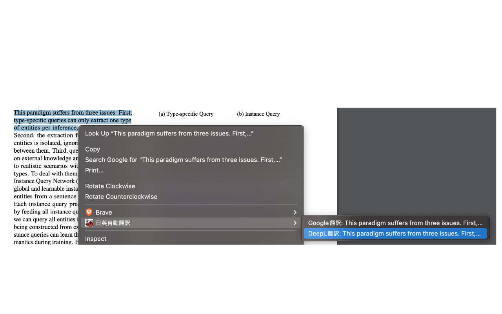

# Auto 日英 Translation

テキストを選択中に右クリックして，Google 翻訳か DeepL 翻訳のページを開きます．
日英の表記は自動判定されるので，日本語を選択中は英語に，英語を選択中は日本語が翻訳ターゲットとなります．

- [Chrome拡張インストールページ](https://chrome.google.com/webstore/detail/%E6%97%A5%E8%8B%B1%E8%87%AA%E5%8B%95%E7%BF%BB%E8%A8%B3/cggoklgmdgpnfhajcnghebgoffnfiffn/related?hl=ja&)

